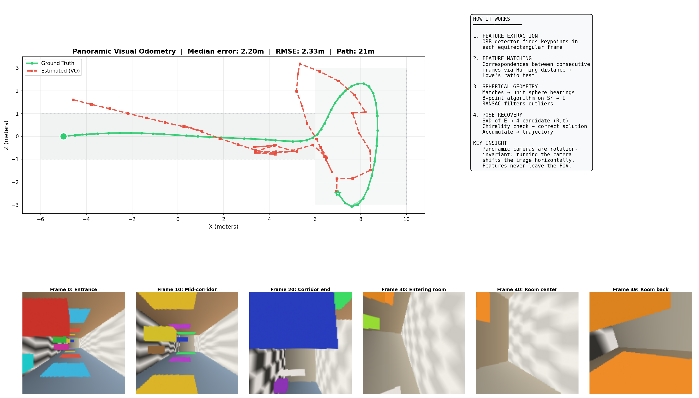
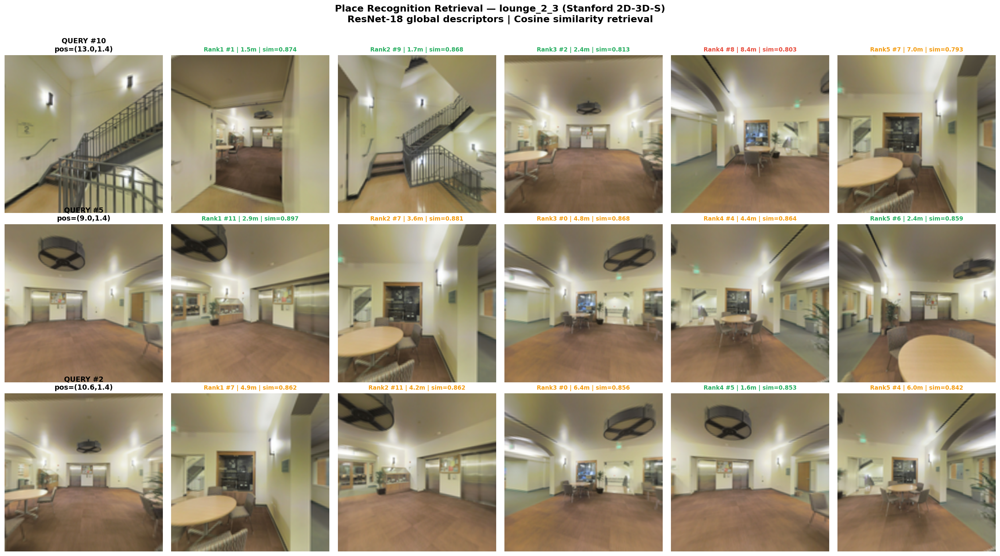
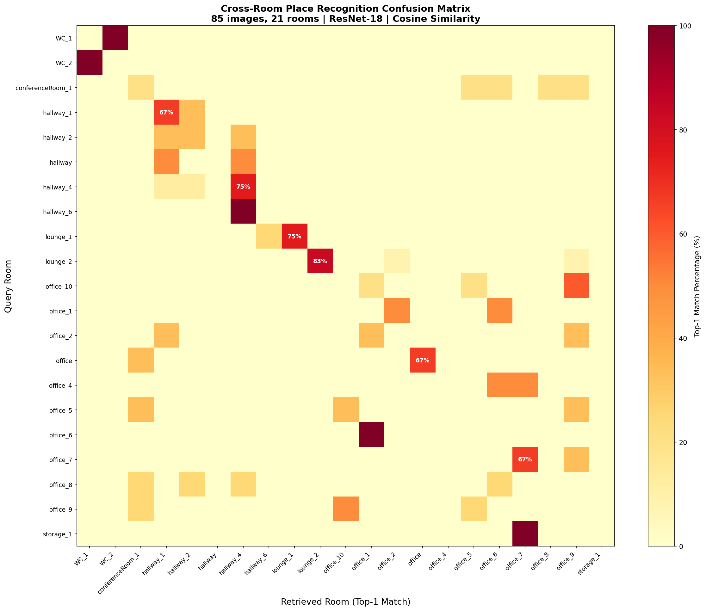

# PanoTrack: Panoramic Visual Navigation

[](https://www.python.org/)
[](https://opensource.org/licenses/MIT)

**Visual Odometry + Place Recognition with 360° Equirectangular Cameras**

A self-contained pipeline demonstrating two core visual navigation capabilities
using panoramic cameras — built in one day, zero external dataset required.

<p align="center">
  
</p>

---

## Why Panoramic Cameras?

For drone navigation, 360° cameras eliminate the single biggest failure mode
of perspective VO/SLAM: **losing feature tracks when the camera rotates.**

| Property | Perspective Camera | Panoramic Camera |
|----------|:-----------------:|:----------------:|
| Field of view | 60–120° | **360° × 180°** |
| Feature persistence on rotation | Lost | **Shift-invariant** |
| Loop closure | Requires camera overlap | **Always sees overlap** |

---

## What This Project Does

### 1. Panoramic Visual Odometry (VO)

Estimates camera trajectory from frame-to-frame motion using **spherical geometry**.

**Pipeline:**
```
ERP image → ORB features → Spherical 8-point algorithm (S²) → RANSAC
         → Essential Matrix → SVD decomposition → (R, t) → Trajectory
```

**Key insight:** Standard VO uses the perspective essential matrix on a tangent
plane. That fails for 360° images because features appear in all hemispheres.
We lift keypoints directly to the unit sphere **S²** and solve there.

| Metric | Value |
|--------|-------|
| Mean position error | 2.22 m |
| Path length | 21 m |
| Drift rate | ~10% |
| Processing | 0.05 s/frame (CPU, ORB) |

---

### 2. Panoramic Place Recognition

Retrieves the most visually similar location from a database of panoramic images.
This is the foundation of **loop closure detection** in SLAM.

**Pipeline:**
```
ERP image → ResNet-18 (pretrained) → 512-d global descriptor
         → Cosine similarity → Nearest neighbor retrieval
```

Evaluated on **Stanford 2D-3D-S** (21 rooms, 85 real equirectangular images):

| Room | Accuracy (top-1 same room) |
|------|:--------------------------:|
| lounge_2_3 (12 views) | **83%** |
| hallway_4_3 (8 views) | **75%** |
| lounge_1_3 (4 views) | **75%** |
| office_3_3 (3 views) | 67% |

<p align="center">
  
</p>

**Perceptual aliasing** (similar-looking offices confused with each other)
remains an open challenge, observable in the cross-room confusion matrix:

<p align="center">
  
</p>

---

## Architecture

```
pano_track/
├── camera.py         Spherical camera model (ERP ↔ S²)
├── scene.py          Procedural indoor 3D scene generation
├── renderer.py       Ray-casting equirectangular renderer
├── features.py       ORB / SuperPoint feature extraction
├── matching.py       Feature matching (BF + ratio test)
├── pose.py           Spherical 8-point + RANSAC + SVD decomposition
├── vo.py             Panoramic Visual Odometry engine
├── placerec.py       CNN global descriptor + place recognition
├── homing.py         Visual homing (snapshot model, exploratory)
├── visualize.py      Visualization utilities
└── stanford_loader.py Stanford 2D-3D-S data loader
```

---

## Quick Start

```bash
# 1. Install
pip install numpy scipy opencv-python matplotlib trimesh rtree torch torchvision pillow

# 2. Generate synthetic dataset (~10 min)
python generate_data.py --width 512 --height 256 --outdir data/proc_scene

# 3. Run Visual Odometry
python run_vo.py --data-dir data/proc_scene --backend orb
# → results/trajectory_views.png

# 4. Generate all visual figures
python make_figures.py
# → results/feature_matches.png, homing_visual.png, trajectory_views.png

# 5. (Optional) Run on Stanford real data
# Download area_3_no_xyz.tar, extract to D:/edge download/
python run_placerec_stanford.py --room lounge_2_3
python viz_placerec.py
# → results/stanford/
```

---

## Design Decisions

| Decision | Rationale |
|----------|-----------|
| **Procedural scene over downloaded dataset** | Zero download, perfect GT, full control |
| **Spherical 8-point on S², not gnomonic projection** | Correct geometry for 360° bearings |
| **ORB as default backend** | No GPU needed, 0.05 s/frame |
| **ResNet-18 for place recognition** | Off-the-shelf, strong baseline |
| **Stanford 2D-3D-S for real-data validation** | Standard benchmark, equirectangular format |

---

## Key References

| Paper | Relevance |
|-------|-----------|
| Scaramuzza, *Omnidirectional Vision* | Spherical camera models |
| Hartley & Zisserman, *Multiple View Geometry* Ch.9 | Essential matrix, epipolar geometry |
| Mur-Artal et al., *ORB-SLAM3* (2021) | SLAM with fisheye/panoramic support |
| Arandjelovic et al., *NetVLAD* (CVPR 2016) | CNN place recognition |
| Armeni et al., *2D-3D-Semantics* (2017) | Stanford dataset |

---

## Limitations

- **Monocular scale ambiguity**: VO recovers translation up to unknown scale
- **No bundle adjustment**: Frame-to-frame drift accumulates (~10% over 21m path)
- **Perceptual aliasing**: Similar rooms (offices) confuse the place recognition model
- **Synthetic scene simplicity**: Corridor geometry limits VO turning performance

---

Built in one day. Questions? Open an issue.
